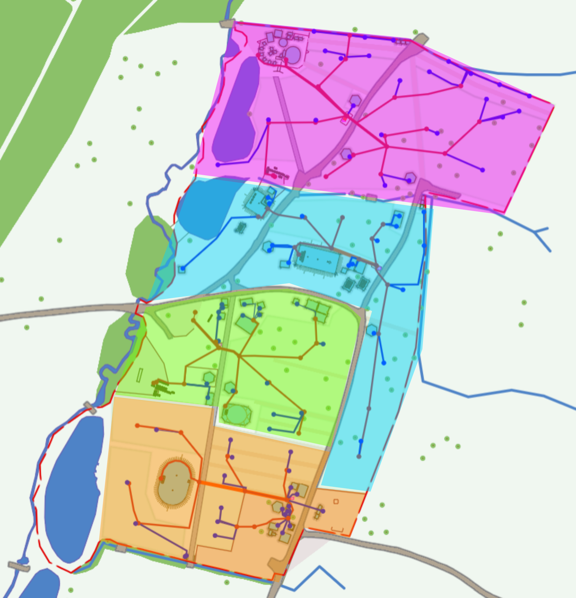
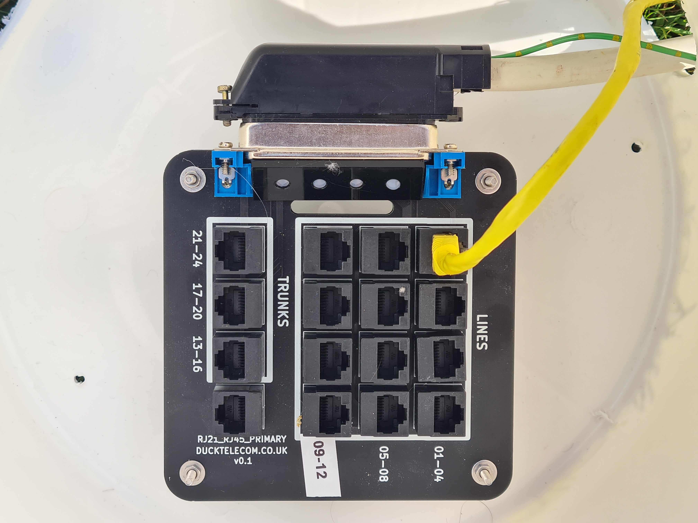

# Getting started

## Things you will need

* Some telecoms apparatus, like a telephone, fax machine or modem
* 50-60m of twisted pair cable. The easiest option is a pre-terminated [CAT5 Ethernet Cable](https://www.amazon.co.uk/Snagless-Ethernet-Network-Compatible-Consoles-Black/dp/B08DCZP1LR)
* Some way of connecting your apparatus to the line. For a standard BT 431A plug the easiest option is an RJ45 coupler and adapter which can be purchased from the ECHQ village, or you can [make your own](../../technical/wiring.md). Remember to include a ring capacitor!
* Optionally - A trunk adapter to break out 4 phone lines on a single CAT5 cable, which might be useful for a village.

<figure markdown="span">
  [{ width="400" }](images/CuTEL_Adapter.jpg)
  <figcaption>A Telephone and adapter</figcaption>
</figure>

## Getting Connected

To connect your telephone apparatus (Telephone, Fax, Modem, etc) to the CuTEL Network you will need to locate your closest Distribution Point. These are purpose built IP rated enclosures more commonly refered to as buckets, and you should be able to find one near your closest [Datenklo (DK)](https://en.wikipedia.org/wiki/Datenklo). N.B The buckets previously contained a sesame seed based product, and lived in a factory that handled seeds / nuts. They have been washed, but some residue remains.

Note that telephone lines _must not_ cross between two electrical grids due to the potential for potential differences - generally if you're having to run a cable over a road, hedge or stream you should find another DK. The grids are shown on the map below.

<figure markdown="span">
  [{ width="400" }](images/EMFGrids.png)
  <figcaption>EMF Power Grids</figcaption>
</figure>

Inside the Distribution Point you will find a patch panel. If you're just connecting a single "line" you can use any of the connectors in the _lines_ section. If you require a "trunk" (4 lines on a single cable) to supply a village or similar use on of the connectors in the _trunks_ section

<figure markdown="span">
  [{ width="400" }](images/CuTEL_DP_1.jpg )
  <figcaption>A Distribution Point</figcaption>
</figure>

Patch your cable by inserting it through the hole in the side of Distribution Point and inserting it into a connector. Be careful to not disturb the other lines, and make sure you fit the lid properly once finished.

## Activating your line

Once connected, you will need to activate your line to receive inbound calls by calling the activations team on 156. You will be assigned a 903XXX number.

### Claim a memorable extension number

You can request a memorable extension number from the [Electromagnetic Phonebook](https://phones.emfcamp.org/). 

Note - You will need to activate your line by calling 156 before claiming a memorable number.  

* [Register an account](https://phones.emfcamp.org/register/)
* Click "Add a Number"
* Chose a memorable number - remember to set the "Type of Service" to POTS
* You'll then get returned to a list of your numbers. Select "Details" for instructions how to claim your number - LD (Pulse) phones will have to use the long format shown on the bottom of the page.

Additional information on number registration, DECT and creating apps can be found on the [EMF Website](https://www.emfcamp.org/about/phones)
