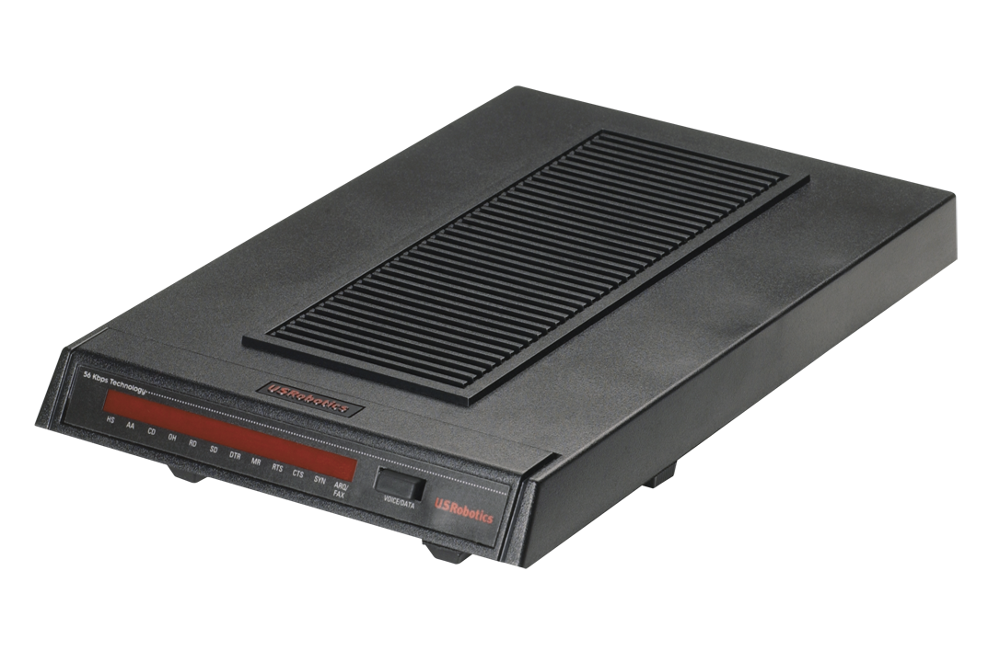

# Dial Up Internet

We provide Dial Up Internet access - up to a blazing 56kb/s.

## Equipment

You will need a modem to connect to Dial Up. We recommend a _real_ modem such as those made by US Robotics, rather than a [winmodem/softmodem](https://en.wikipedia.org/wiki/Softmodem)

If you intend to host your own Dial Up service on a CuTEL line, please get in touch so we can optimise your line.

<figure markdown="span">
  [{ width="400" }](images/usr-modem.png)
  <figcaption>US Robotics Modem</figcaption>
</figure>

## Number

The Dial up number will be confirmed soon!

## Authentication

Also coming soon!

