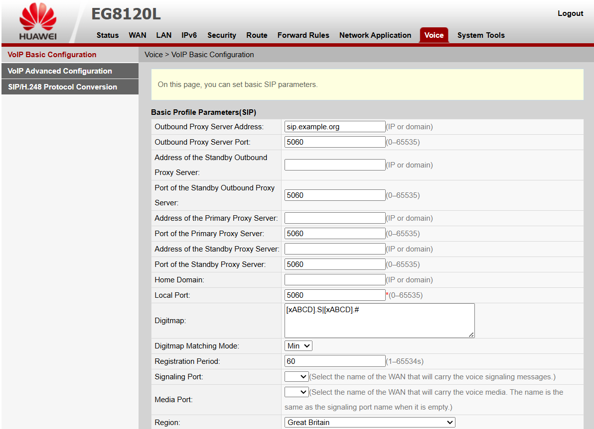
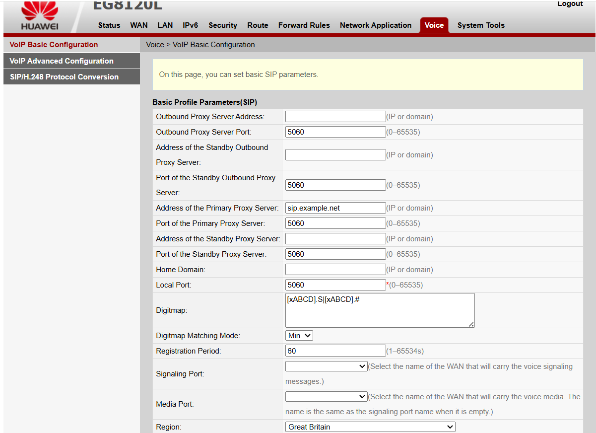

### Configuring your OLT for VoIP

Many of the Huawei ONTs have an "FXS" port that allows you to connect an analogue phone. To use this you will have to manually configure your ONT.

* Get a SIP account from your favourite provider, e.g the EMF Phone Team
* Connect a computer directly to the ONT 
* Configure a static IP on your computer so you can access the ONTs web interface. The IP is usually printed on the back, but the default is `192.168.100.1`  Remember to set your IP to something unique in the same subnet, e.g  `192.168.100.10` 
* Open the ONTs IP in your browser and login. The default username and password is `telecomadmin` / `admintelecom`.
* Go to the **WAN** tab in the top menu bar, then click "new"
* Configure the connection using the below screenshot and table as a reference:

<figure markdown="span" style="margin-left: 0; text-align: left;">
  [{ width="400" }](images/huawei_onu_voip_voice_server.png )
</figure>

| **Setting** | **Value** |
| ---         | ---       |
| Enable WAN  | Yes       |
| Encapsulation Mode | IPoE |
| Protocol Type | IPv4 |
| WAN Mode | Route WAN |
| Service Type | VoIP |
| Enable VLAN | Yes |
| VLAN ID | 102 |
| IP Acquisition Mode | DHCP |
| Enable NAT | No |

* Go to the **VOICE** tab in the top menu bar
* Configure the settings for your server using the screenshot and table below as a reference

<figure markdown="span" style="margin-left: 0; text-align: left;">
  [{ width="400" }](image/huawei_onu_voip_voice_server.png )
</figure>

| **Setting** | **Value** |
| ---         | ---       |
| Address of the Primary Proxy Server | sip.example.org | 
| Port of the Primary Proxy Server | 5060 | 
| Region | Great Britain | 