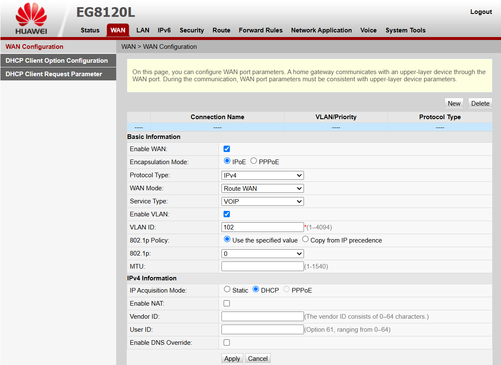

# Internet Services

This year we will be offering a plethora of Internet Services, supporting up to 1Gb/s !

## Notes

* All these services are best effort, experimental, and provided for fun. If you want reliable internet maintained by _real_ network engineers, please use the services provided by the EMF NOC Team.
* Please disable WiFi on any routers or equipment you're using, ideally before arriving on site.

## Dial Up Internet

We will be providing Dial Up Internet access across the entire site - up to a speedy 56kb/s.

### Required Equipment

* A 50m ethernet cable + BT Adapter
* A suitable dial up modem - We recommend a _real_ modem such as those made by US Robotics, rather than a [winmodem/softmodem](https://en.wikipedia.org/wiki/Softmodem)

If you intend to host your own Dial Up service on a CuTEL line, please get in touch so we can optimise your line.

<figure markdown="span">
  [{ width="400" }](images/usr-modem.png)
  <figcaption>US Robotics Modem</figcaption>
</figure>

### Accessing the service

Telephone numbers and login credentials will be announced closer to the event

## VDSL/ADSL2 (Fibre to the DK)

We will be providing DSL services in a limited trial area (TBC), with blazing fast speeds of up to 80Mb/s down and 20Mb/s up !

### Required Equipment

* A 50m ethernet cable + BT Adapter
* A router with builtin ADSL2 or VDSL modem
* **OR** a separate router + DSL modem
* A DSL filter

### Accessing the service

Login credentials will be announced closer to the event.

## GPON (Fibre to the Tent)

We are intending to run a GPON network in a limited trial area (TBC). You may know this style of service as “Fibre to the Premises” - or in this case Fibre to the Tent.

We'll be offering up to face melting Gigabit speeds!

### Required Equipment

You'll need some hardware to connect to the GPON network:

- An ONT
- A suitable fibre - the splitter end should be SC APC (Green) and the ONT end should match your hardware.
- You may want to bring a suitable router, but you could connect a laptop directly if you're packing light

### ONT Compatibility

A table of ONTs that have been tested and confirmed as working can be found below.

* We'd recommend using one of the Openreach ones as they're easy to get hold of and come with a quality UK power supply.
* We **do not** recommend using an ONT that you intend to use with a "real" ISP in future, as our service will provision the equipment and we cannot _guarantee_ that it won't cause issues with another ISP.

| **Make / Model** | **Interfaces** | **FXS** | **CATV** | **Price** |
| --- | --- | --- | --- | --- |
| Nokia G-010G-R (Openreach) | 1GE | No | No | £10 (Second Hand) |
| Adtran SDX611 (Openreach) | 1GE | No | No | £10 (Second Hand) |
| V-Sol V2801SG  | 1GE | No | No | £15.59 |
| Huawei EG8120L  | 1GE + 1FE | Manual | No | £15 |
| Huawei HG8230V | 2FE | Manual | No | £6.50 |

### Accessing the service

When you connect your ONT, it should be automatically provision general internet access on the 1st ethernet interface (untagged)

PPPoE is the prefered method of connecting, but we also support DHCP for a "Plug and Play" experience. PPPoE credentials will be announced closer to the event.

### Configuring your OLT for VoIP

Many of the Huawei ONTs have an "FXS" port that allows you to connect an analogue phone. To use this you will have to manually configure your ONT.

* Connect a computer to the ONT 
* Configure a static IP on your computer so you can access the ONTs web interface. The IP is usually printed on the back, but the default is `192.168.100.1`  Remember to set your IP to something unique in the same subnet, e.g  `192.168.100.10` 
* Open the ONTs IP in your browser and login. The default username and password is `telecomadmin` / `admintelecom`.
* Go to the WAN tab in the top menu bar, then click "new"
* 

<figure markdown="span">
  [{ width="400" }](images/huawei_onu_voip_wan.png )
  <figcaption>Huawei WAN Configuration</figcaption>
</figure>

### Other notes

- Fibre optics don't like sharp bends or other mechanical stress
- Dirty connectors can reduce performance. Avoid touching them, and apply dust caps when not in use.
- SC APC and SC UPC connectors will physically connect, but it can damage them. Avoid mixing connector types / colours.
- GPON uses lasers. These are at low power levels, but avoid looking directly into any connectors.