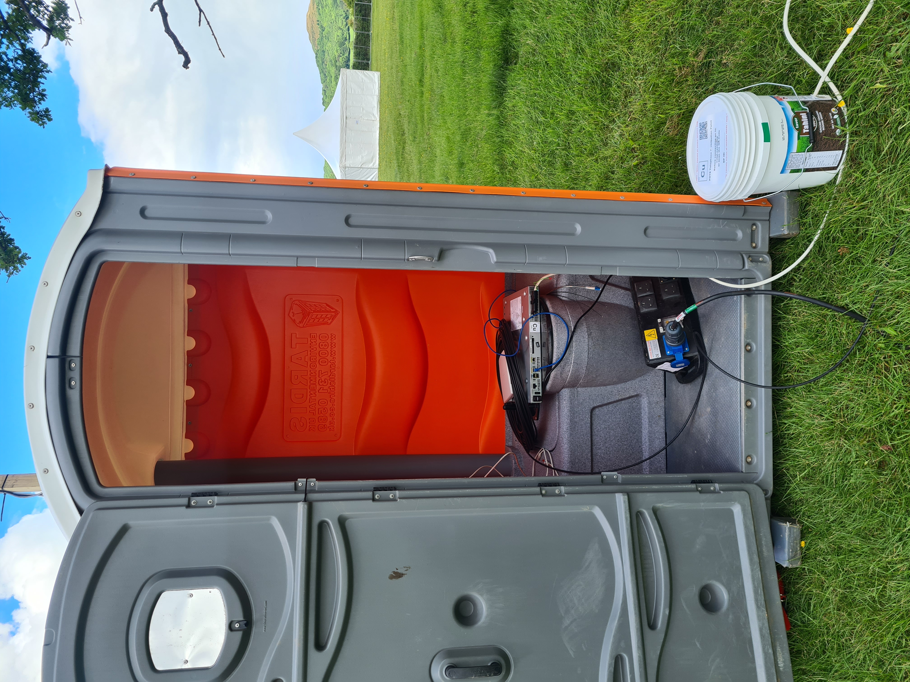

# Welcome to CuDocs

Welcome to the CuTEL Documentation! Our next major event will be [Electromagnetic Field 2026](https://www.emfcamp.org/), where we will be providing the finest copper based telephony and more!

!!! note "Quick Start"

    You can find the documentation for EMF 2026 [here](events/emf26/getting_started/).

<!-- We're also in the process of creating some [technical documentation](technical/index.md) covering how to run your own copper telephone network, and more generic hints and tips on configuring Cisco voice hardware and other comms equipment. It's a work in progress and might be a bit rough around the edges for a while so bare with us. If you'd like to contribute, checkout the [github repo](https://github.com/cu-telecom/cutel-docs) or get in touch. -->

## What is CuTEL?

CuTEL is a tongue-in-cheek telco founded in 2021 to supply enthusiasts at hacker camps, retro computing festivals and other events with traditional copper telephony services including faxing, dial up internet.

[EMF](https://www.emfcamp.org/) is the largest event where we deploy 500+ lines for a 4 day event, but we love demonstrating communications equipment at smaller events too. With copper telephone lines rapidly [disappearing in the UK](https://en.wikipedia.org/wiki/Telephony_copper_plant_retirement_in_the_United_Kingdom) we feel like it's more important than ever to preserve history.  

If you'd like us to come to your event please [get in touch](https://cutel.net/contact/)

<figure markdown="span">
  [{ width="400" }](images/datenklo.jpg)
  <figcaption>A Datenklo with a CuTEL distribution point installed</figcaption>
</figure>
