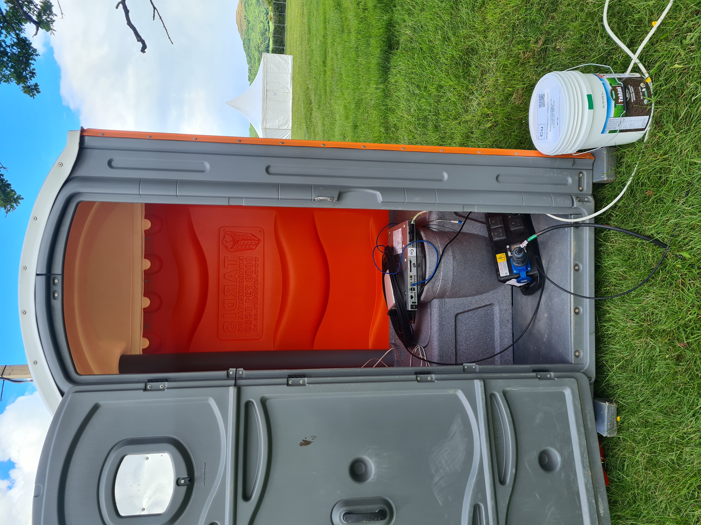

# Welcome to CuDocs

Welcome to the CuTEL Documentation! It mostly applies to the network that will be operating at [EMF Camp](https://www.emfcamp.org/) between May 30th – June 2nd 2024.

If you're looking to get connected to the network see [Getting Started](getting_started.md)

## What is CuTEL?

CuTEL is a tongue-in-cheek telco founded in 2021 to supply enthusiasts at hacker camps, retro computing festivals and other events with traditional copper telephony services including faxing, dial up internet.

[EMF](https://www.emfcamp.org/) is the largest event where we deploy 500+ lines for a 4 day event, but we love demonstrating communications equipment at smaller events too. With copper telephone lines rapidly [disappearing in the UK](https://en.wikipedia.org/wiki/Telephony_copper_plant_retirement_in_the_United_Kingdom) we feel like it's more important than ever to preserve history.  

If you'd like us to come to your event please [get in touch](https://cutel.net/contact/)

<figure markdown="span">
  [{ width="400" }](images/datenklo.jpg)
  <figcaption>A Datenklo with a CuTEL distribution point installed</figcaption>
</figure>
