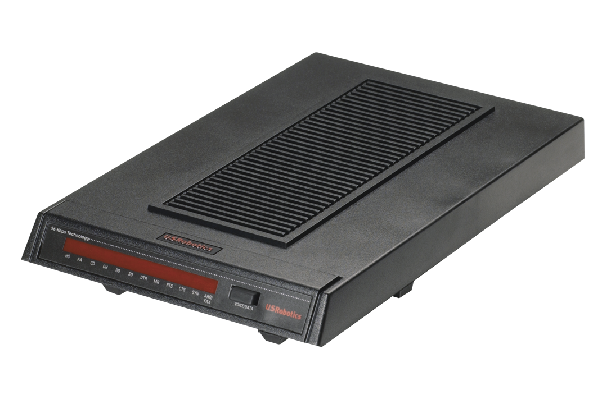

# Dial Up Internet

We provide Dial Up Internet access - up to a blazing 56kb/s.

## Equipment

You will need a modem to connect to Dial Up. We recommend a _real_ modem such as those made by US Robotics, rather than a [winmodem/softmodem](https://en.wikipedia.org/wiki/Softmodem)

If you intend to host your own Dial Up service on a CuTEL line, please see the technical page for [modems](../technical/modems.md)

<figure markdown="span">
  [{ width="400" }](../images/usr-modem.png)
  <figcaption>US Robotics Modem</figcaption>
</figure>

## Number

To connect to Dial Up you will need to call 903920, or `ATDT903920`

## Authentication

Logging in with different credentials will connect you to different services

### Protoweb

[Protoweb](https://protoweb.org/) is a free public service that hosts historical Internet websites to demonstrate the Internet in it’s early days by currating and restoring websites from [https://archive.org/](https://archive.org/)

**Username:** protoweb@protoweb.org  
**Password:** protoweb  
**Home Page:** http://www.inode.com  
**Search:** http://search.inode.com  

### Clearnet

AKA The public internet. Note that due to the massive bloat of modern websites your experience will be poor. Try to find low bandwidth services.

**Username:** clearnet@cutel.net
**Password:** clearnet