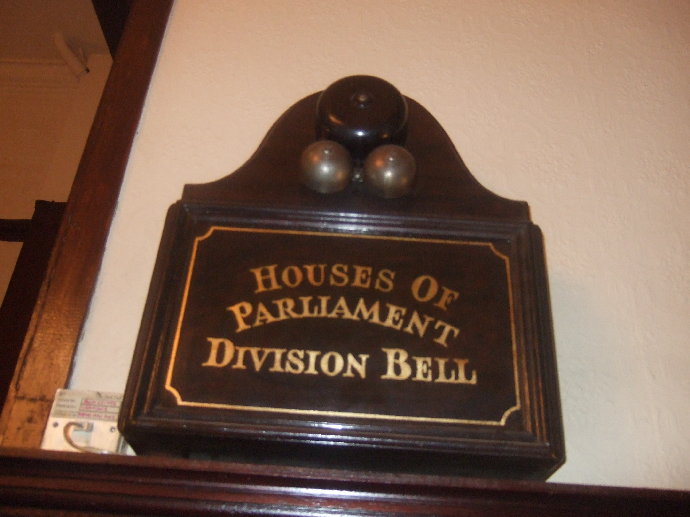

# Dinner Bell

The Dinner Bells distributed across the site ring when the volunteer kitchen is serving meals to volunteers. They're inspired by the Houses of Parliament's [Division Bells](https://en.wikipedia.org/wiki/Division_bell) that are situated in neighbouring buildings (including pubs) and signal a vote is about to take place.

EMF is entirely volunteer run and is always in need volunteers - before, during and after the event.

Volunteering helps make the event better for everyone, guarantees you ticket for the next event and earns you a free meal at the volunteer kitchen!

To sign up to volunteer or learn more see [https://www.emfcamp.org/volunteer/info](https://www.emfcamp.org/volunteer/info)

<figure markdown="span">
  [{ width="400" }](../images/Division-bell.jpg)
  <figcaption>A Division Bell</figcaption>
</figure>

