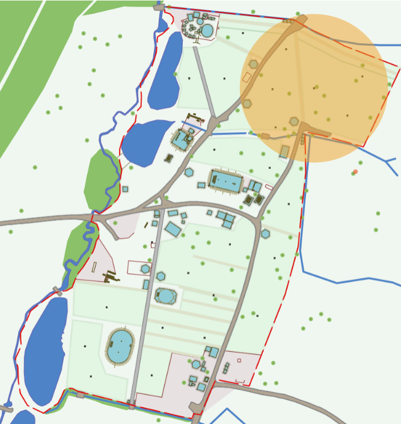

# DSL

We are hoping to operate ADSL and VDSL2 services in a limited trial area located in the North-East of the site around [DKC1](https://map.emfcamp.org/#15.48/52.041349/-2.375839/m=52.0429946,-2.3748114)

If you can't camp in this area but which to play with VDSL, you're welcome to drop by the ECHQ Village

**Note:** This is a _trial_ and might not come to fruition.

## Trial Area

The area highlighted in orange represents the maximum reach of 100m of cable but you should allow for bends etc and a few metres at each end for patching.

<figure markdown="span">
  [{ width="400" }](../images/CuTEL_DSL_TRIAL.png)
  <figcaption>DSL Trial Area</figcaption>
</figure>

## Equipment
 
 - Lots of CAT5 or twisted pair cable, up to 100m. Terminated with CAT5 as per the [wiring diagram](../technical/wiring.md))
 - A router or modem that supports ADSL2 or VDSL2. You _must_ be able to disable the WiFi functionality on it, ideally prior to EMF.

<figure markdown="span">
  [{ width="400" }](../images/Cisco_887.jpg)
  <figcaption>Cisco 887</figcaption>
</figure>

## Authentication 

TBC
