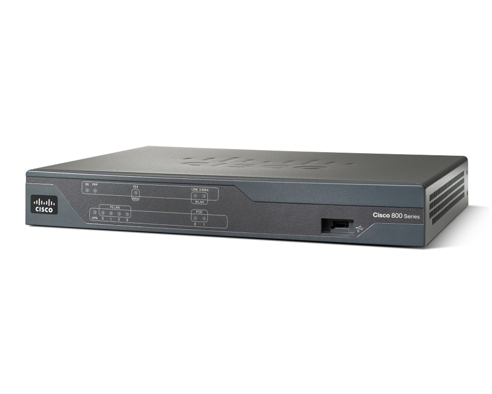

# DSL

We are _hoping_ to operate ADSL and VDSL2 services in a limited trial area which will be announced closer to EMF.

## Equipment

You will need a router or modem that supports ADSL2 or VDSL2. You _must_ be able to disable the WiFi functionality on it, ideally prior to EMF.

<figure markdown="span">
  [{ width="400" }](../images/Cisco_887.jpg)
  <figcaption>Cisco 887</figcaption>
</figure>

## Authentication 

TBC
