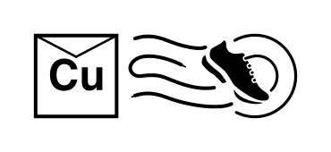

# Telemessage

Telemessage is an innovative new service brought to you by CuTEL in partnership with the EMF Sneakernet team that allows you to send  messages via your fax machine for delivery via mail and likewise allows someone to place a message in a Sneakernet post box for delivery via fax. 

<figure markdown="span">
  [{ width="400" }](../images/Telemessage-Sneakernet-logo.png)
  <figcaption>Telemessage / Sneakernet</figcaption>
</figure>

## Sending a Telemessage via a Fax Machine

### Obtaining the template

A template is available to make sending Telemessages easier. It's laid out to make your messages compatible with the Telemessage envelopes.  

1. Call 903991 from your fax machine. 
2. Hangup when you hear "Fax Requested"
3. Shortly after you should receive a fax of the template

### Sending

  1. Write who or where the message should be sent to. This would normally be a village name, location, or otherwise identifiable description. Including things like a DECT number can be helpful
  2. Write who the message is from. Remember to include your name, village, and fax / DECT number
  3. Send the fax to 903990
  4. Your Telemessage will then be delivered by the Sneakernet team

## Sending a Telemessage via post

  1. Grab a piece of paper
  2. Write the fax number where the Telemessage should be sent to. Make it obvious it should be faxed.
  3. Write who the Telemessage is from. This would normally be a village name, location, or otherwise identifiable description. Including things like a DECT number can be helpful
  4. Place the message in a Sneakernet post box
  5. Once collected, your Telemessage will be faxed to the recipient 

## Notes

  * For more information on Sneakernet see the EMF Wiki
  * Messages should consist of a single sheet of clean and dry A4 paper
  * Messages should comply with the [Code of Conduct](https://www.emfcamp.org/code-of-conduct) 