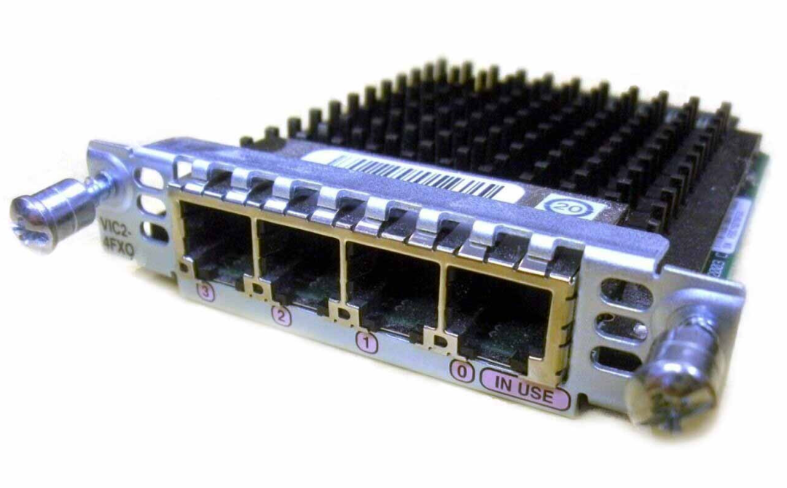

# VIC-nFXO

The VIC-nFXO is a "Voice Interface Card" the provides Foreign eXchange Office (FXO) ports. An FXO emulates a telephone connected to a phone line vs an FXS which emulates the exchange side.

<figure markdown="span">
  [{ width="400" }](images/vic2-4fxo.png)
  <figcaption>A Cisco VIC2-4FXO</figcaption>
</figure>

There are a number of models:

* VIC-2FXO  - 2 FXO interfaces
* VIC-4FXO  - 4 FXO interfaces
* VIC2-2FXO - 2 FXO interfaces
* VIC2-4FXO - 4 FXO interfaces

## Compatibility 

A good guide to FXO compatibility is available [here](https://web.archive.org/web/20120509232620/https://www.andovercg.com/datasheets/cisco-2fxo_vic.pdf)

Note that the first generation VIC-nFXOs are region specific and some router models will require a "Carrier Module" to interface with them. 

### VIC2-nFXO

The VIC2-nFXO has been tested on the following hardware:

| **Router Model** | **IOS**     | **Working** | **Notes**               |
|------------------|-------------|-------------|-------------------------|
| 2811             | 15.1(4)M12a | Yes         |                         |

## Configuration

### SIP Phone / PSTN Gateway

The following configuration will allow you to register two SIP devices such as a phones to a Cisco router and make / receive calls via the 2 lines connected to a VIC2-2FXO. Each SIP device has a _dedicated_ "line", meaning calls from SIP extension 1001 will always go out via one FXO, and calls from extension 1002 will go out via the other FXO. Likewise inbound calls to one FXO will always go to 1001, and calls to the other will always go to 1002. There is no hunting or ring group logic.

You will need to manually configure the SIP device as we're not using any auto-provisoning features aimed at Cisco phones.

**Note:** Putting a SIP device on the internet, particularly an unsupported Cisco router is, unwise. This documentation assumes your SIP device is connecting to your router over a LAN / secure network, and the router isn't directly accessible from the internet.

To start, we configure the voice and telephony services:

```
voice service voip
 allow-connections sip to sip
 sip
  bind control source-interface FastEthernet0/0
  bind media source-interface FastEthernet0/0
  registrar server
!
!
voice register global
 mode cme
 max-dn 10
 max-pool 10
 authenticate register
 ! The realm can be an IP, FQDN, or random string. If you forget it, phones won't register
 authenticate realm dontforgetthis
 !
 !
telephony-service
 max-ephones 10
 max-dn 10
 auto assign 1 to 10
!
```

Next configure Class of Restriction (COR) lists so we can force calls from a particular SIP extension out of a dedicated FXO. I've named them after the FXO devices, but they can be anything:

```
 dial-peer cor custom
 name FXO030
 name FXO031
!
dial-peer cor list FXO030
 member FXO030
!
dial-peer cor list FXO031
 member FXO031
```

Next setup the "Directory Numbers" (extensions). Remember to use a secure password:

```
!
voice register dn  1
 number 1001
 name 1001
!
voice register dn  2
 number 1002
 name 1002
!
!
! Note: id mac can be any MAC, as long as its unique per pool. It's used for templating out 
! configuration files, which we're not using. However, it must be defined. 
!
voice register pool  1
 id mac 0011.2233.4455
 number 1 dn 1
 cor incoming FXO030 default
 username 1001 password 1234
!
voice register pool  2
 id mac 0011.2233.4466
 number 2 dn 2
 cor incoming FXO031 default
 username 1002 password 1234
!
```

Next configure the FXO voice-ports, setting the `cptone` and `impedance` for your region. `connection plar` will force any calls to that FXO to the defined extension:

```
!
voice-port 0/3/0
 cptone GB
 timeouts ringing 120
 connection plar 1001
 impedance complex2
!
voice-port 0/3/1
 timeouts ringing 120
 connection plar 1002
 impedance complex2
!
```
Next configure the dial-peers that route calls from the SIP extensions out of the FXO interfaces. Note that we apply the corlists to force each extension out a dedicated line:

```
!
dial-peer voice 100 pots
 corlist outgoing FXO030
 destination-pattern .T
 port 0/3/0
 forward-digits all
!
dial-peer voice 101 pots
 corlist outgoing FXO031
 destination-pattern .T
 port 0/3/1
 forward-digits all
!
```

Now you'll need to draw the rest of the owl and configure your SIP devices to use your Router IP and the associated username and password for that extension. Once that's completed, you should be able to make and receive calls. 

#### Notes

* If the FXOs are connected to an FXS in another Cisco device, you might find inbound calls drop as soon as they start to ring. If that happens, you might need to apply `no battery-reversal` to the FXS. Here's what my FXS config looks like on a VG224:

```
voice-port 2/8
 ring cadence pattern11
 no battery-reversal
 alt-battery-feed feed2
 compand-type a-law
 cptone GB
 timeouts interdigit 3
 timeouts call-disconnect 10
 timeouts ringing 120
 impedance complex2
 station-id number 903762
!
```