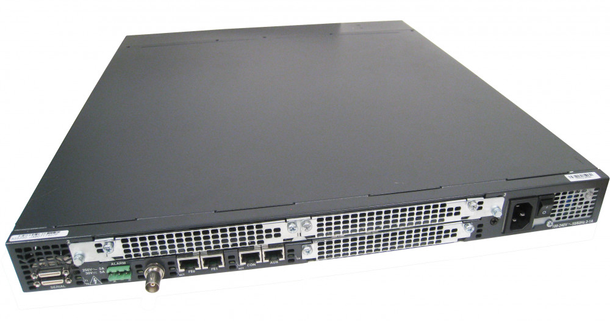

# AS5350

The Cisco AS5350 "Universal Gateway" is a big box of DSPs that can provide various functions including modem call termination, email-to-fax, fax-to-email, and a TDM-to-VoIP gateway. It feels like we've only scratched the surface of what it can do, but what we've uncovered so far is documented here.

<figure markdown="span">
  [{ width="400" }](images/AS5350.png)
  <figcaption>A Cisco AS5350</figcaption>
</figure>

## Note

At present this documentation is somewhat sparse, and doesn't cover how to get calls into the AS5350. We'll hopefully add more in the near future.

## Use cases

### Forwarding PPP to an LNS, and steering BBS connections with RADIUS

At CuTEL events we use the AS5350 for 2 main functions - providing PPP "Dial Up internet" services, and to allow traditional modems to connect to Telnet BBSs. As a general rule we like to keep the Cisco configuration relatively static and handover control to other devices.

For Dial Up we forward all the PPP to an LNS via L2TP. At EMF 2026 we will be using a Juniper MX as an LNS, which can forward L2TP to other LNSs based on RADIUS responses using a feature it calls L2TP Tunnel Switching (We'll cover this in more detail in future). For BBS access we use "preauthentication" via RADIUS to send calls to a particular number to the associated Telnet service. 

#### Resource Profiles

We use resource-pool profiles to steer calls to specific groups of modems which have different settings applied. There is one potential downside to this setup. As the pools are statically defined with 40 modems each, if 41 PPP users connect the 41st call will fail rather than overflowing to the other 80 idle modems. In practice, we rarely see enough usage for this to become an issue.

We have 3 such groups:

##### ppp

These are grouped as a "Group-Async" interface with ppp enabled. We also apply a "modemcap" to apply various settings to the modems to provide a premium 56k experience. 

##### viewdata

[viewdata](https://en.wikipedia.org/wiki/Viewdata) is a strange beast that uses 7E1 encoding, and v.23 (1200/75 baud). We apply a special modemcamp to force the AS5350's modems into the correct mode.

##### bbs

BBSs tend to use standard 8N1 encoding, and the AS5350 will happily handle falling back to the fastest mode the originating modem will support, so we don't do anything special here - we apply the same modemcap as the ppp lines.

#### Steering BBS access with RADIUS 

Rather than hardcoding BBSs into the AS5350 which ties up a group of dedicated modems, we use RADIUS to dictate which number routes to which BBS. The flow is documented below:

When the call first hits the AS5350 it will send a RADIUS Access-Request:

TODO: Add notes about CLID. Also edit first Access Accept request thing.

```
RADIUS Access-Request

  User-Name: 920
  User-Password: (Hashed Password)
  Service-Type: Outbound (5)
  Called-Station-Id: 920
  NAS-Port-Type: Virtual (5)
  NAS-Port: 20030
  NAS-Port-Id: Serial3/0:30
  NAS-IP-Address: 104.18.2.24
```

If the "User-Name" (i.e the Called number) is valid, the RADIUS server responds with a basic Access-Accept to instruct the AS5350 to answer the call:

```
RADIUS Access-Accept
```

When the call is _answered_ the AS5350 will send another Access-Request. You'll notice this time the `Called-Station-Id` has changed to the actual Callers number. 

The Called number in the Username can be used to map different numbers to different BBSs. The `Called-Station-Id` could potentially be used to drop connections from bad users.

```
RADIUS Access-Request

  User-Name: 920
  User-Password: (Hashed Password)
  Service-Type: Outbound (5)
  Called-Station-Id: 801
  NAS-Port-Type: Virtual (5)
  NAS-Port: 20030
  NAS-Port-Id: Serial3/0:30
  NAS-IP-Address: 104.18.2.24

```

The RADIUS server responds with the following, which instructs the AS5350 to bridge the modem call to a BBS operating on `104.18.3.24:2015`


```
RADIUS Access-Accept

Service-Type      = Login-User (1)
Login-Service     = Telnet (0)
Login-IP-Host     = 104.18.3.24
Login-TCP-Port    = 2015
Cisco-AVPair      = "preauth:auth-required=0"
Cisco-AVPair      = "preauth:service-type=1"
```


#### Configuration

First of all we configure "dnis groups" groups of numbers which point to each type of service. They can accept individual numbers, a range of numbers, or both:

```
dialer dnis group ppp
 number 1000
dialer dnis group bbs
 number 1001
 range 1002 2000
dialer dnis group viewdata
 range 2001 2999
 ```

Then we enable and configure the resource-pools thats used to associate a "profile" to a pool of modems:

```
!
resource-pool enable
!
resource-pool group resource ppp
 range port 1/0 1/39
!
resource-pool group resource bbs
 range port 1/40 1/59
 range port 2/0 2/19
!
resource-pool group resource viewdata
 range port 2/20 2/59
!
```

Then we configure resource-pool profiles for "customers". These associate a `dnis group` (telephone numbers) with a `resource-pool group` (group of modems)

```
resource-pool profile customer ppp
 limit base-size all
 limit overflow-size all
 resource ppp speech
 dnis group ppp
!
resource-pool profile customer bbs
 limit base-size all
 limit overflow-size all
 resource bbs speech
 dnis group bbs
!
resource-pool profile customer viewdata
 limit base-size all
 limit overflow-size all
 resource viewdata speech
 dnis group viewdata
```

Next set the country you're located in to optimise the modems:

```
spe country united-kingdom
```

Then create the modemcap entries for "regular" calls and "viewdata" calls:

```
modemcap entry regular:MSC=&FS29=6S64=0S21=1S12=8S13=0S14=1
modemcap entry viewdata:MSC=&FS0=0S29=4S64=9S21=0S12=7S13=1S14=1ATE1
```

Next configure the lines (modems):

```
! Configure the lines for PPP. Nothing special here.
line 1/00 1/39
 modem InOut
 modem autoconfigure type regular
!
! The following lines are used for BBS calls. They appear as two blocks because they span two modem cards
line 1/40 1/59
 modem InOut
 modem autoconfigure type regular
 escape-character NONE
 autohangup
!
line 2/00 2/19
 modem InOut
 modem autoconfigure type regular
 escape-character NONE
 autohangup
!
!
! The following lines are for viewdata, so we apply the viewdata modemcap to handle v.23 7E1
line 2/20 2/59
 modem InOut
 modem autoconfigure type viewdata
 escape-character NONE
 autohangup
```

Async interfaces:

```
! This Async Group is used for PPP connections
interface Group-Async0
 ip unnumbered GigabitEthernet0/0
 ip virtual-reassembly in
 encapsulation ppp
 dialer in-band
 dialer idle-timeout 600
 dialer-group 1
 async mode dedicated
 no keepalive
 ppp authentication pap
 group-range 1/00 1/39
!
! This Async Group is used for everything else
interface Group-Async1
 no ip address
 async mode interactive
 group-range 1/40 2/59
```

Configure Virtual Private Dialup Network (VPDN) to forward PPP calls to an LNS. Remember to update the IP and tunnel password for your LNS:

```
vpdn enable
vpdn search-order dnis
!
vpdn-group ppp
 request-dialin
  protocol l2tp
  dnis ppp
 initiate-to ip 192.168.9.2
 l2tp tunnel password 0 SECRET
```

Configure the RADIUS server:
```
radius-server host 192.168.9.5 auth-port 1812 acct-port 1813
radius-server key 0 SECRET
```

Configure aaa and preauth. Before you do, make sure you have a user configured. Failure to do so might result in you getting locked out the device.

```
username admin privilege 15 secret 0 YOUR_PASSWORD
!
aaa new-model
!
aaa authentication login default local
aaa authentication enable default enable
aaa authorization console
aaa authorization exec default local if-authenticated
!
aaa preauth
 group radius
 dnis bypass ppp ! We don't do preauth for PPP, it goes straight to the LNS
 dnis required
 clid required
```

