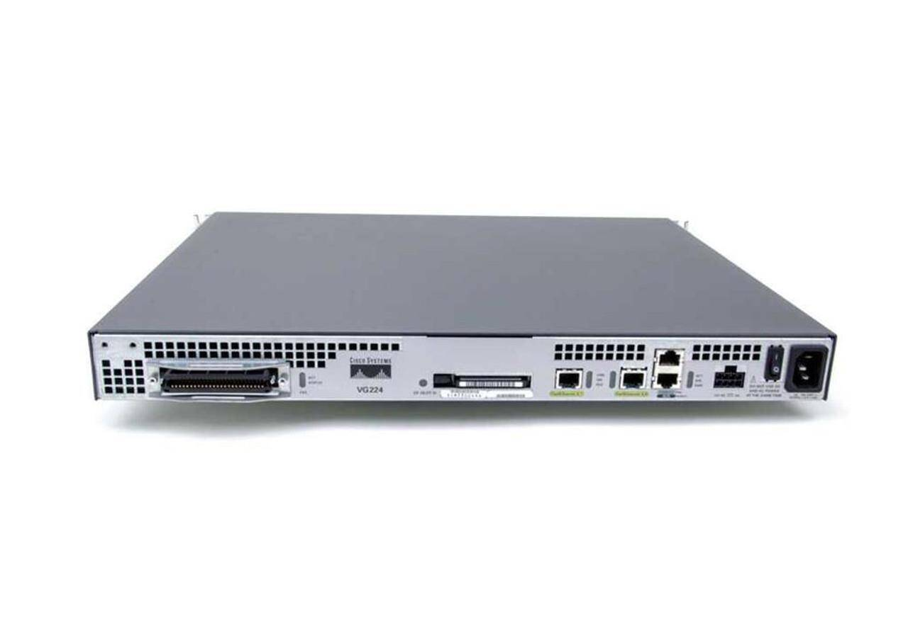

# Technical

This is where we're going to start building up some documentation on running your own copper telephone network, hint and tips on configuring Cisco voice equipment, and more generic documentation for comms equipment.

Note: It's currently under construction!

<figure markdown="span">
  [{ width="600" }](images/vg224.jpg)
  <figcaption>A Cisco VG224</figcaption>
</figure>
