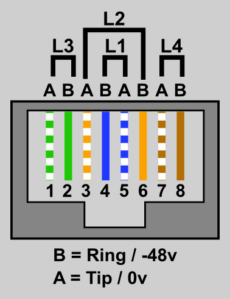

When we were planning the network for EMF 2022, we opted to go with 8P8C "RJ45" connectors for subscriber facing distribution to avoid punch downs or jelly crimps. The cables and connectors are cheap and ubiqutous, can be picked up from just about anywhere and can carry 4 telephone lines if required. Adapters are also available in most countries to convert between 8P8C and the local connector of choice, e.g A BT 431 or TAE socket, which make it the ideal choice for international events.

Unsure of the optimum pinout, we reached out to our friends at [Shadytel](https://shady.tel/) to find out what they use at their events, and they confirmed they use T568A. We propose this becomes the "standard" for Hacker Camps and similar events.

If you want to make your own cables, sockets, or Network Termination Equipment, refer to the diagram below. 

 - For a single line you just need to connect pins 4 & 5
 - For a trunk you will need to connect all the pins
 - Note that the wiring scheme is T568A, however you can use the more common T568B - it's only the pinout that matters

<figure markdown="span">
  [{ width="400" }](images/CuTEL-RJ45-Standard-Trunk.png)
  <figcaption>RJ45 Pinout - Looking into socket</figcaption>
</figure>
